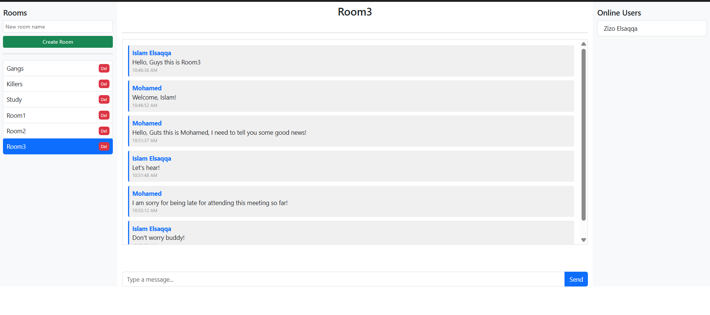
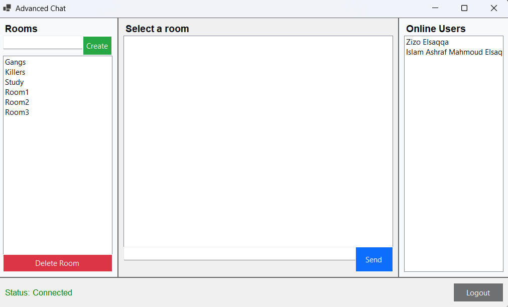

# 🚀 Advanced Real-time Chat System

<div align="center">


**A real-time chat platform built with ASP.NET Core 8, SignalR, Entity Framework Core, SQL Server, JWT Authentication, ASP.NET Identity, ASP.NET MVC, and Windows Forms, enabling secure, real-time communication across web and desktop clients.**

</div>

---

## 🎥 Demo

📹 **Watch the project demo here**

```
https://vimeo.com/1206461262
```

---

## 📸 Screenshots

### 🌐 MVC Web Application

<p align="center">
    
</p>

---

### 🖥️ Windows Forms Desktop Client

<p align="center">
    
</p>

---

## ✨ Features

- 🔐 JWT Authentication & ASP.NET Identity
- 💬 Real-time communication using SignalR
- 🏠 Create, join and delete chat rooms
- 📜 Persistent message history
- 👥 Online users tracking
- 🌐 ASP.NET MVC Web Client
- 🖥️ Windows Forms Desktop Client
- ⚡ Live synchronization across all connected clients

---

## 🏗️ Architecture

```text
                ASP.NET MVC Client
                        │
                        │ REST API + SignalR
                        │
Windows Forms Client ───┤
                        │
                  ASP.NET Core API
        (Controllers • SignalR • Identity)
                        │
             Entity Framework Core
                        │
                   SQL Server
```

---

## 🛠️ Technologies

- ASP.NET Core 8 Web API
- ASP.NET MVC
- SignalR
- Entity Framework Core
- SQL Server
- ASP.NET Identity
- JWT Authentication
- Windows Forms (.NET 8)
- Bootstrap 5
- JavaScript

---

## 🚀 Getting Started

```bash
git clone https://github.com/IslamElSaqqa/RealTimeChat-System-SignalR.git
```

Update the connection string inside:

```
API/appsettings.json
```

Apply migrations:

```bash
dotnet ef database update
```

Run:

- API
- MVC
- Windows Forms (optional)

---

## 📂 Project Structure

```
AdvancedChat-System
│
├── API (WEB API)
├── Web (MVC-Application)
└── Desktop (WinForms)

```

---

## 👨‍💻 Author

**Islam Ashraf Mahmoud Elsaqqa**

**Full-Stack .NET Developer | Software Engineer | ITI 9-month Graduate**
**Professional Development & BI-Infused CRM Track**

<a href="https://www.linkedin.com/in/islam-elsaqqa/" target="_blank">
    
</a>

<a href="https://github.com/IslamElSaqqa" target="_blank">
    
</a>

<a href="mailto:islamelsaqqa2002@gmail.com">
    
</a>

</p>